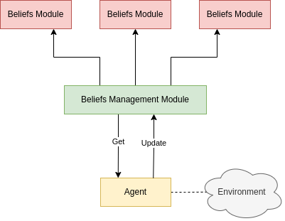

# Agent 1

## Requirements

- [x] Environment Sensing
    - [x] Store map values
    - [x] Detect other agents
    - [x] Detect parcels
- [ ] Beliefs Revision
    - [ ] Store agent beliefs history
    - [ ] ~~Store parcel beliefs history~~
    - [ ] Error management
        - [ ] Correct positional error on agents
        - [ ] Apply probability model
    - [ ] Model other agent intentions
      - [ ] create general intention structure
      - [ ] go_to intention
      - [ ] pick_up intention
      - [ ] reach_destination intention
- [ ] Intention Revision
    - [ ] TODO
- [ ] Plan Elaboration
    - [ ] Static plan Library
        - [ ] TODO
    - [ ] PDDL
        - [ ] TODO
    - [ ] Update library with new pddl plans


## Beliefs management and revision

To manage and revise beliefs the agent uses function exposed by the *Belief Management Module* which act as an 
aggregator for all the other *Belief Modules*, which are a sort of data layer modules that implement and exposes CRUD 
functions on data that is being kept private.

### Belief Management Module

Is an aggregator module, that works as a middleware between the *Belief Modules* and the *Agent*.
It exposes CRUD functions similar to the one exposed by the *Belief Module* connected but apply additional logic to
the data in input to adjust the new beliefs and to update multiple modules at the same time.




### Belief Module

Has the functionalities of a module in a Data Layer, it manages access to the data source through CRUD operations.
They are implemented as a JavaScript module, exposing only the CRUD functions, keeping the variables that represent
the data source inaccessible.
There are two type of Belief Module, the ones that manage and represent the current beliefs and the one that keeps 
a short history of certain beliefs.

example:
> The AgentBeliefs module keeps track of the current beliefs on the position, direction, score etc. of each other agent
> the agent is aware of.
> Instead, AgentHistoryBelief keeps track of the previous states of AgentBeliefs, and it's used to take decision or 
> validate new states of the belief.


### Belief revision

At each event (onAgentSensing, onParcelSensing) the agent has to revise its beliefs, correct errors, update the history.

#### Revision after Agent event

- increase the agent event logical clock.
- add to current beliefs the agents sensed.
  - in case the position is not an integer round it to the closer integer.
  - determine its direction based off its history, if any
- update the history of the agent.
- update the current beliefs and history of the known agents that were not sensed.
  - reduce the probability of the belief (by some standard value?)
  - determine its next position based off its previous position, direction and possible intentions.
    - i.e.: given a parcel in (x:4,y:4), agent A in (x:4,y:1), and possible intention of picking up the parcel, we can 
      deduce that the next position of agent A will be (x:4,y:2) even if we don't sense him.
  - once the probability of the prediction becomes too low: we can safely remove all the beliefs for that agent?

#### Revision after Parcel event

- increase the parcel logical clock.
- add beliefs of sensed parcels.
- update the history of the sensed parcels.(?)
- update the beliefs of the parcel not sensed
  - in case it wasn't held by another agent
    - decrease the probability of the belief.
    - decrease its score (should check configuration by how much, or use actual timestamp to decide)
    - if there is an intention regarding that parcel (pick_up) that should be completed (checking the metadata) update 
      its held status.
  - in case it was held by another agent
    - decrease the probability of the belief.
    - update it's position based on the next step of the agent holding it.
    - we could also completely ignore it and remove it.
- if the believed score reach 0 remove the belief about the parcel.

#### Other agents intention beliefs

There could be 3 types of intentions: *pick_up*, *go_to*, *reach_destination*.
The intention *pick_up* infer that the agent will first *go_to* the position of the parcel.
After a *pick_up* intention is completed (which is verifiable only if the agent is sensed) we can deduce it will have a 
*reach_destination* intention if no other available parcel are near (that we know of), which is basically a *go_to* 
intention but for the nearest destination (which is in the beliefs for the parcel), otherwise it will have another
*pick_up* intention for the nearest available parcel.

Intentions are created and revised at each event.
Ideally each agent will have one *pick_up* intention or one *reach_destination* intention and one or two *go_to*.

A *pick_up* intention is created if:
1. we sense an agent and a parcel
2. the parcel is available (i.e.: distance of the agent from the parcel + distance of the parcel from a destination < 
   current score of the parcel AND our distance from the parcel > his distance from the parcel), a probability should 
   be given to the intention based on the distance of the agent to the parcel.
Each *pick_up* intention could generate a series of *go_to* sub-intention to describe the road that the agent will take
to reach the agent. One possibility could be to calculate the shortest route and describe it entirely inserting the 
appropriate timestamp for each, but it could be costly and not useful (as we could just change direction, lose 
visibility of the agent and discard the intention by the time it will actually reach the parcel), instead another
option could be to calculate only the next 1 or 2 step every time we sense its presence, so to use that information to 
avoid being blocked.
If we do not sense the agent anymore we can delete the intention, maybe after 2 steps or so.

A *go_to* intention describe the next step of an agent, it's described by a starting position, an ending position and a
corresponding logical timestamp.
In case of an agent that is being sensed the intention is checked on the actual data, if at some point it turns out to
be wrong we delete all the intentions of the corresponding agent and check again for intentions.
In case of an agent outside our visibility we will use the next *go_to* intention in combination with the corresponding
*pick_up* or *reach_destination* intention to create a new *go_to* with the next step, giving it a reduced probability.
We use the *go_to* intention also to determine the believed position of an agent outside our vision.
Once the probability of a *go_to* intention is below a certain limit we just consider the intention invalid.

A *reach_destination* intention is created if a sensed agent has completed a *pick_up* intention and there is not a
condition for another *pick_up* intention or if we sense an agent that has already picked up some parcel and:
1. there is not another parcel near (more near to him than us at least).
2. if there is it's not in his direction, and it's not worth to pick it up (i.e.: he is nearer to the destination than
    the parcel, or the parcel is not available, same check as pick_up).
Similarly to a *pick_up* intention it will define a series of *go_to* intentions, and if some of them are sensed to be
wrong we consider the whole intention as invalid and remove it.

### Beliefs structure

#### Agents Beliefs

```typescript
{
    id: string; 
    name: string;
    position: {
        x: number;
        y: number;
    }
    score: number;
    direction: "unknown" | "left" | "right" | "down" | "up";
    time: number;
    probability: number;
}
```

#### Parcels Beliefs

```typescript
{
    id: string;
    position: {
        x: number;
        y: number;
    }
    carriedBy: string;
    reward: number;
    distance_from_destination: number;
    time: number;
    probability: number;
}
```

#### Intention

